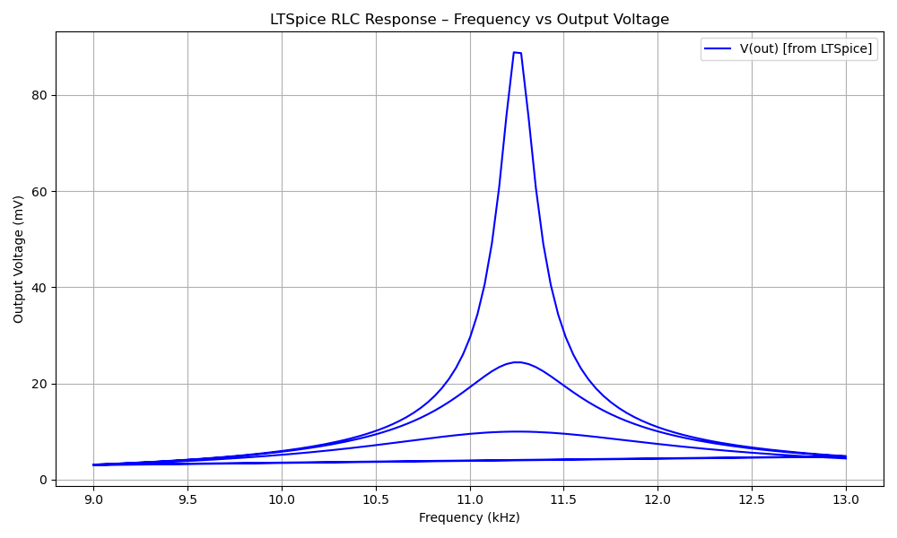

# LC Resonance Circuit – LTSpice Simulation & Python Visualization

This project simulates an **LC resonance circuit** with variable damping resistance using **LTSpice**, and visualizes the results using **Python (Matplotlib)**. It is part of my coursework in *Bauelemente und Schaltungstechnik* at Universität Siegen and contributes to my analog/mixed-signal skill development.

---

## 🔧 Project Overview

A classic RLC series circuit was designed to analyze how the damping resistor (R2) affects the resonance peak and bandwidth.

**Component values:**
- **L** = 20 mH  
- **C** = 10 nF  
- **R2** = [20 Ω, 80 Ω, 200 Ω]  
- **AC Source** = 1V small signal sweep (AC analysis)

🧠 **Goals:**
- Identify the resonant frequency
- Observe the impact of damping resistance on output voltage
- Calculate bandwidth and quality factor (Q)

---

## 🧪 LTSpice Simulation

An AC sweep analysis was performed in LTSpice. Voltage output was observed and exported for further analysis.

📁 Files:
- `Aufgabe_LC_Resonance/RLC.asc` – LTSpice schematic  
- `Aufgabe_LC_Resonance/report.pdf` – Full write-up with circuit theory and observations  
- `Aufgabe_LC_Resonance/rlc_response.txt` – Exported data from LTSpice's waveform viewer  

---

## 📊 Python Visualization

The exported `.txt` file was processed using a custom Python script. The complex voltage (in dB) was converted to linear scale (mV) and plotted across frequency.

📁 Files:
- `plot_rlc_response.py` – Python script for parsing and plotting  
- `rlc_response_plot.png` – Output image (frequency vs voltage)

📉 Preview:



---

## 📁 Folder Structure

```plaintext
LC-Resonance-Circuit-ltspice/
├── README.md
└── Aufgabe_LC_Resonance/
    ├── RLC.asc                  ← LTSpice schematic
    ├── report.pdf               ← Full assignment report
    ├── rlc_response.txt         ← Exported simulation data
    ├── plot_rlc_response.py     ← Python script for plotting
    └── rlc_response_plot.png    ← Resulting frequency response plot
```

---

## 👨‍🎓 Author

### **Mainak Roy**

🎓 *M.Sc. Electrical Engineering – Electronics Design & Technology*  
🏫 *Universität Siegen*  

---
